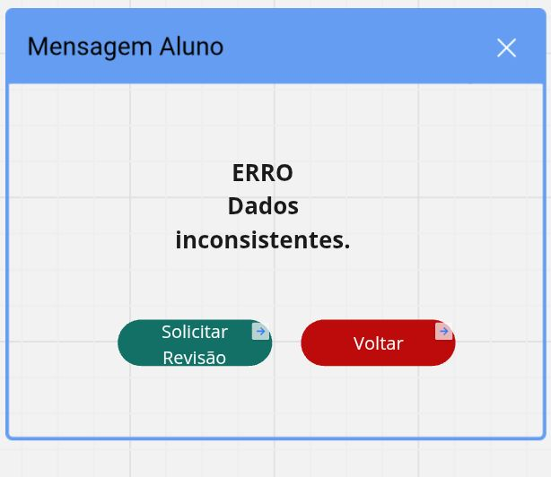

# pi-sistema-gestao-universitario  
**Disciplina:** Desenvolvimento de Sistemas Orientado a Objetos  
**Instituição:** SENAC  
**Professor:** Enoque Felipe dos Santos Leal  

---

## Integrantes  
- Eduardo Dorea De Oliveira Macario Muniz  
- Guilherme Stark  
- Alexandre de Souza Sol  
- Leticia Silva Ferreira  
- Maria Adelia Sena de Lucena  
- Rodrigo Pinto do Amaral Lopes  
- Carlos Raphael Nunes Albuquerque  
- João Ricardo Vano Ferreira  

---

## Objetivo do Projeto  
Desenvolver um sistema orientado a objetos para **gestão de dados de uma universidade**, com foco em cadastros de diferentes perfis de usuários: alunos, professores, fornecedores, pessoas físicas e pessoas jurídicas.  

O projeto está dividido em fases:  
1. **Fase 1:** Modelagem UML (diagramas de caso de uso, classes e descrição de cenários).  
2. **Fase 2:** Protótipos funcionais das interfaces, de acordo com os diagramas da Fase 1.  

---

## Diagramas UML (Fase 1)  
### Diagrama de Caso de Uso

### Cenários de Cadastro
#### Pessoa Física  
- **Principal:** Administrador cadastra Nome, CPF, Data de Nascimento e Endereço → sistema valida CPF → salva dados.  
- **Alternativos:** CPF já cadastrado, CPF inválido, dados incompletos.  
- **Pré-condição:** Administrador logado.  
- **Pós-condição:** Pessoa Física registrada e disponível para associação a alunos/professores.  

#### Pessoa Jurídica  
- **Principal:** Administrador cadastra CNPJ, Razão Social, Endereço, Tipo de Serviço → sistema valida CNPJ → salva dados.  
- **Alternativos:** CNPJ já cadastrado, CPF inválido, dados incompletos.  
- **Pré-condição:** Administrador logado.  
- **Pós-condição:** Pessoa Jurídica vinculada ao sistema.  

#### Professor  
- **Principal:** Secretaria cadastra Matrícula, Departamento, Titulação, Salário → sistema associa a Pessoa Física existente.  
- **Alternativos:** Matrícula duplicada, Pessoa Física não cadastrada.  
- **Pré-condição:** Pessoa Física cadastrada.  
- **Pós-condição:** Professor recebe acesso ao sistema acadêmico.  

#### Aluno  
- **Principal:** Secretaria cadastra Matrícula, Curso, Período, Turno → sistema associa a Pessoa Física e gera e-mail institucional.  
- **Alternativos:** Curso sem vagas, dados inconsistentes.  
- **Pré-condição:** Pessoa Física cadastrada.  
- **Pós-condição:** Aluno recebe acesso ao portal acadêmico.  

#### Fornecedor  
- **Principal:** Secretaria cadastra Tipo de Fornecimento e CNPJ → sistema valida e salva dados.  
- **Alternativos:** CNPJ não cadastrado, pendência financeira.  
- **Pré-condição:** Pessoa Jurídica cadastrada.  
- **Pós-condição:** Fornecedor incluído no sistema de compras.  

### Diagrama de Classes  

---

## Protótipos (Fase 2)  
Os protótipos foram desenvolvidos no **Figma**, refletindo os cenários principais e alternativos da Fase 1.  

Acesse todos os protótipos aqui: [Protótipos no Figma](https://miro.com/app/board/uXjVJMVUzZ4=/?moveToWidget=3458764639411856994&cot=10)  

### Telas de Cadastro
- Pessoa Física  
  

- Pessoa Jurídica  
  

- Professor  
  

- Aluno  
  

- Fornecedor  
  

### Telas do Sistema
- Tela Inicial  
  

- Sistema Universidade - Secretaria  
  

- Sistema Universidade - Administrador  
  

- Login  
  

### Mensagens e Erros
- Cadastro Realizado  
  

- CPF Inválido  
  
  

- Dados Incompletos  

- Cadastro Realizado Professor

  
- Cadastro Realizado Aluno

- Cadastro Realizado Fornecedor 

- Erro Cadastrado  
  

- Erro Inválido  

 
- Erro Duplicidade

- Erro Dados

- Erro Pessoa Física

 
- Erro sem vagas

- Erro Pessoa Jurídica

- Erro Pendências

### Telas Auxiliares

- Lista de espera

- Revisão de Dados

- Pendências Financeiras
 

 
  
---

## Estrutura do Repositório  
/pi-sistema-gestao-universitario  
├── imagens/ # Diagramas e prints dos protótipos  
├── README.md # Documentação principal do projeto  

---

## Referências  
- [Guia definitivo para diagramas UML](https://miro.com/pt/diagrama/o-que-e-uml/)  
- COSTA, M. A. S. *Modelagem de um sistema acadêmico baseado em UML para universidades federais*. Dissertação (Mestrado em Ciência da Computação) – UFMG, 2021. Disponível em: https://repositorio.ufmg.br/handle/1843/36789
